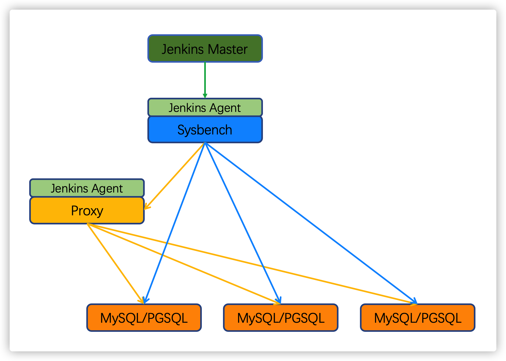
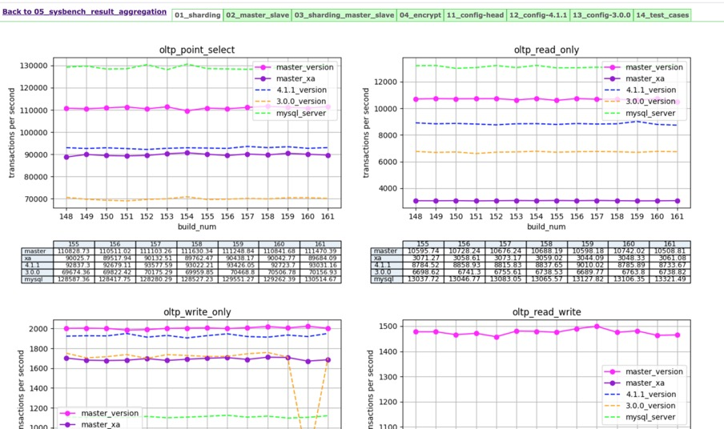

## SharingSphere sysbench pressure test toolbox


### Sysbench Introduction

sysbench is an opensource scriptable multi-threaded benchmark tool based on LuaJIT. Usually benchmark for CPU, Memory, I/O and so on. The contained script could benchmark the performance for OLTP like database.

SharingSphere invoke Sysbench as the part of performance test, mainly for MySQL, PGSQL and Proxy, and then compare the performance of proxy and other database.  

### Sysbench Test Environment

The performance test is triggered by jenkins schedule task, base on the hardware like following:

| Host     | CPU     | Memory | IP |
| ------   | ------  | ---  | --- |
| Jenkins  | 4 core  | 8G   | 10.0.100.10 |
| Sysbench | 8 core  | 16G  | 10.0.100.20 |
| Proxy    | 32 core | 32G | 10.0.100.30 |
| MySQL or PGSQL | 32 core | 32G  | 10.0.100.40 |
| MySQL or PGSQL | 32 core | 32G  | 10.0.100.41 |

Network is 10Gb Ethernet



for example there are 5 machines, the ip and hardware like upon picture

Install jenkins on `10.0.100.10`, and config 2 nodes.

Install sysbench on `10.0.100.20`, and launch up the agent on `10.0.100.20`，`10.0.100.30`, the agent could download from jenkins

### Jenkins Pipeline

Sysbench 是不依赖 Jenkins 以及任何 CI/CD 工具的，甚至可以手动在命令行中执行 sysbench 的脚本。选用 Jenkins 的目的是利用 Jenkins 的 pipeline 管理压测流程，使之透明化、自动化。
Sysbench doesn't rely on and CI/CD tool, it could execute in console manually.

如下为 Jenkins 管理压测步骤的流程：

  1. Install Proxy
  2. Prepare Sysbench
  3. Prepare Proxy
  4. Test Proxy

#### 安装 proxy

在这一阶段，Jenkins 会通过 agent 创建 proxy 所需目录，通过 git 克隆 ShardingSphere 的代码，编译 ShardingSphere 的代码，解压缩编译后的 proxy districution

#### 准备 sysbench

在这一阶段，Jenkins 会通过 agent 创建 sysbench 结果集所需要的目录，准备好 sysbench 所需的脚本跟参数

#### 准备 proxy
 
在这一阶段，Jenkins 会将 proxy 所需的配置文件跟驱动准备好（例如 MySQL Driver），复制到 proxy 中的相应目录并且启动 proxy。

#### 测试 proxy

在这一阶段，Jenkins 会根据配置文件中的参数启动 sysbench 压测 proxy。压测结束后，会通过一个 Python 脚本将不同批次的压测结果整合并输出为图片，在 Jenkins 的 report 中即可查看不同批次的结果变化。

### sysbench 的 report

sysbench 的结果会输出为一个 .txt 文件，内容类似如下：

```
SQL statistics:
    queries performed:
        read:                            28147663
        write:                           0
        other:                           0
        total:                           28147663
    transactions:                        28147663 (156336.98 per sec.)
    queries:                             28147663 (156336.98 per sec.)
    ignored errors:                      0      (0.00 per sec.)
    reconnects:                          0      (0.00 per sec.)

General statistics:
    total time:                          180.0437s
    total number of events:              28147663

Latency (ms):
         min:                                    0.59
         avg:                                    2.46
         max:                                  281.08
         99th percentile:                        5.28
         sum:                             69103716.45

Threads fairness:
    events (avg/stddev):           73301.2057/786.12
    execution time (avg/stddev):   179.9576/0.01
```

项目中的 python 脚本会根据 sysbench 生成如下的统计图表：



### 如何自己通过 Jenkins 做同样的测试

建议 fork 一份当前项目，然后创建 Jenkins 的 pipeline，`Pipeline` 部分选择 `pipeline script from SCM`。SCM 的 git 地址为当前项目地址 `https://github.com/apache/shardingsphere-benchmark.git`

想测试什么类型的数据库组合，根据不同的 script path 进行设置：

测试 mysql : sysbench/mysql/sysbench-mysql.pipeline
测试 pgsql : sysbench/mysql/sysbench-pgsql.pipeline
测试 proxy + mysql : sysbench/proxy-mysql/sysbench-proxy-mysql.pipeline
测试 proxy + pgsqsl : sysbench/proxy-pgsql/sysbench-proxy-pgsql.pipeline

同时修改 `.env` 文件以及 `prepared-conf` 中对应的 yaml 配置，以期符合自己的测试需求
> 如果需要测试 mysql，需要自行将 MySQL 的 driver(例如 mysql-connector-java-8.0.24.jar) 放入要测试的目录的 prepared-conf 下。
如下图所示 : 

